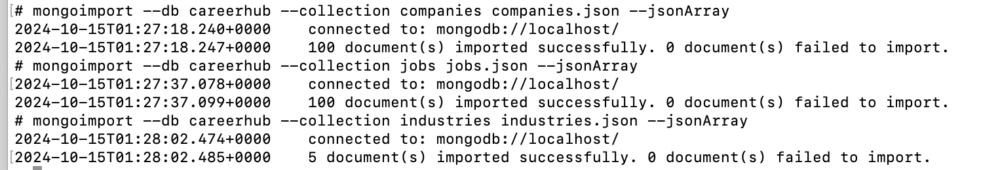
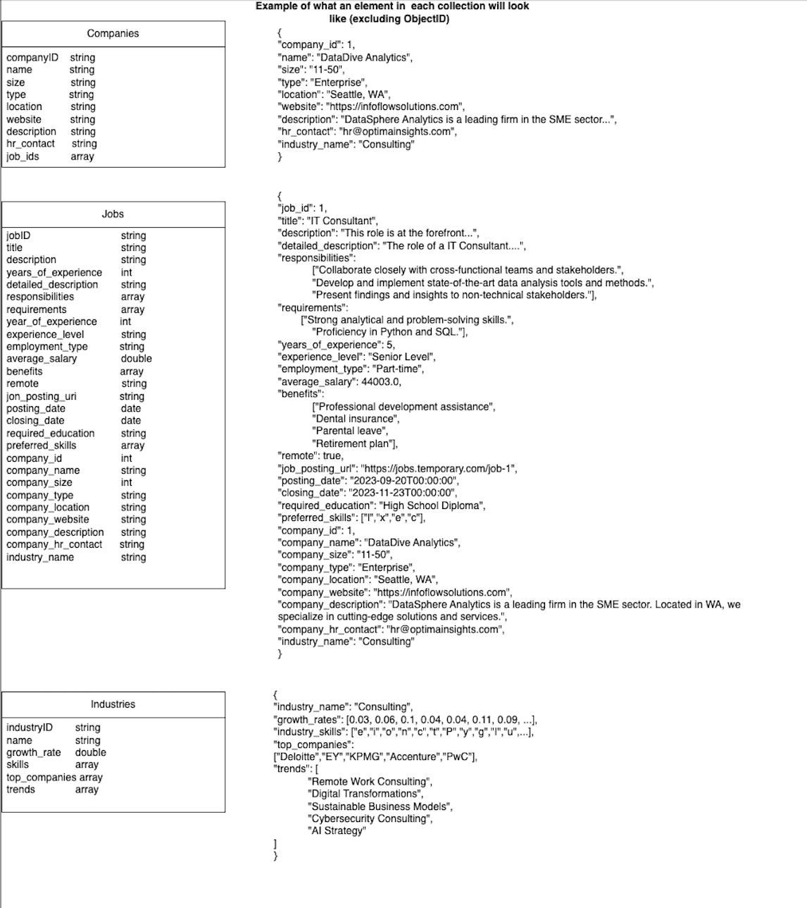

# CareerHub: Mini Job Portal with MongoDB and Flask
> Fall 2024

## Overview

CareerHub is a mini job portal application built with MongoDB and Flask. It provides a RESTful API for managing job postings, allowing users to create, view, update, and delete job listings. The application also offers advanced querying capabilities such as searching by salary range and experience level.

## Features

- Create new job postings
- View job details by ID
- Update existing job postings
- Delete job listings
- Query jobs by salary range
- Filter jobs by experience level
- Add more industry details
- View top companies in a specific industry
- Get general information about a specific industry
- Get general information about a specific company
- Search which jobs are posted in a certain industry 


## Setup and Installation

### Prerequisites

- Docker Desktop
- Postman

### Steps

1. Clone the repository:

   ```
   git clone https://github.com/yourusername/careerhub.git
   cd careerhub
   ```

2. Edit the docker-compose.yml file to change the volume to the path on your local machine where the project is stored (the default is the Desktop/vanderbilt/fall_24/nosql/MiniProject2 directory on my local machine, so you'll want to change that to a path on your local machine)

3. Build container (make sure docker is running):

```
docker-compose up 
```

4. Import data into MongoDB:

   - Open a new tab in your terminal and enter the mongo shell:

   ```
   docker-compose exec -it mongodb sh
   ```

   - You should see the mongo shell prompt.

   - Run the following commands one at a time :

   ```
   cd /ds5760/mongo
   mongoimport --db careerhub --collection jobs --file jobs.json --jsonArray
   mongoimport --db careerhub --collection industries --file industries.json --jsonArray
   mongoimport --db careerhub --collection companies --file companies.json --jsonArray
   ```

   - You should see the following output:
   

5. Open Postman and test the endpoints (see API Endpoints section below)

The application should now be running on `http://localhost:5001`.

## API Endpoints

1. **Homepage**
   - URL: `/`
   - Method: GET
   - Description: Displays a welcome message

2. **Create Job Post**
   - URL: `/create/jobPost`
   - Method: POST
   - Description: Creates a new job posting

3. **View Job Details**
   - URL: `/search_by_job_id/<job_id>`
   - Method: GET
   - Description: Retrieves details of a specific job by ID

4. **Update Job Details**
   - URL: `/update_by_job_title`
   - Method: POST
   - Description: Updates details of a job by its title

5. **Remove Job Listing**
   - URL: `/delete_by_job_title`
   - Method: POST
   - Description: Deletes a job listing by its title

6. **Salary Range Query**
   - URL: `/jobs/salary_range`
   - Method: GET
   - Query Parameters: `min_salary`, `max_salary`
   - Description: Retrieves jobs within a specified salary range

7. **Job Experience Level Query**
   - URL: `/jobs/experience_level`
   - Method: GET
   - Query Parameter: `experience_level`
   - Description: Retrieves jobs matching a specific experience level

8. **Industry Info**
   - URL: `add/industry_info`
   - Method: POST
   - Query Parameter: `industry_name`
   - Description: Adds or updates industry information

9. **Top Companies in an Industry**
   - URL: `/top_companies_by_industry`
   - Method: GET
   - Query Parameter: `industry_name`
   - Description: Retrieves top companies in a given industry based on job listing count

10. **View Industry Info**
   - URL: `/industry_info`
   - Method: GET
   - Query Parameter: `industry_name`
   - Description: Retrieves industry information based on industry name

11. **View Company Info**
   - URL: `/company_info`
   - Method: GET
   - Query Parameter: `company_name`
   - Description: Retrieves company information based on company name

12. **Search_jobs_by_industry**
   - URL: `/search_by_industry`
   - Method: GET
   - Query Parameter: `industry_name`
   - Description: Retrieves jobs in a specific industry

## Testing

You can test the API endpoints using tools like Postman. Ensure to set the appropriate headers and request bodies as required by each endpoint. All POST endpoints provide detailed instructions when accessed with a GET request. If you get confused about any of the endpoints, you can always refer to the code in the `career_hub.py`. Future work will focus on building a more user-friendly front-end for this application. 

## Schema Design 

Below are the schemas for the jobs, industries, and companies collections in my database:



The justification for the schemas is as follows:

- **Jobs Collection**: This is the core of the career hub and is designed to store job postings with all of the information associated with them. The job_id is used to uniquely identify each job listing. The reason I chose to include so many fields is because I wanted to store all of the information associated with each job listing in one place. From my prior experience with job portals, as a user I want to see all of the information about a job before I even apply, so I built this into the schema.

- **Industries Collection**: This schema is designed to store industry information with attributes such as industry_name, growth_rates, and industry_skills. This schema allows for easy querying and analysis of industry trends and skills without a focus on any specific job or company.

- **Companies Collection**: This schema is designed to store company information with attributes such as company_id, name, size, type, location, website, description, and hr_contact.  This schema allows for easy querying and analysis of company information. This scheme allows someone to learn about a company without necessarily having to consider specific jobs, and I think this is important for a job portal for people to learn what is out there, even if there are no jobs currenly available or posted. 

In future iterations, I would consider a more nested structure and building out more tailored collectios for different points of view, for example, a user or a company. This solution is more of a prototype and would be improved with user testing. 

## File Structure

- app/career_hub.py: Contains the Flask application code and API endpoints.
- app/__ init __.py: Intializes the Flask application 
- app/utils.py: Contains utility functions used by the Flask application.
- data_transformation.py: Contains the code to transform the data and load it into the database.
- mp2-data/: Contains the data files used to populate the database.
- docker-compose.yml: Contains the configuration for the Docker containers.
- requirements.txt: Contains the dependencies for the project.
- schema_design.png: Contains the schema design for the jobs, industries, and companies collections.

## Generative AI Usage 

I attempted to write all of the code by myself, however, I used generative AI to help me understand errors I was encountering, review my code, and proofread my work. Below is a list of how I specifically used generative AI in each of the deliverables for my project:

- career_hub.py
   - As I was developing each function, I used Claude 3.5 Sonnet to help me brainstorm what validation or error handling I should add to my code (eg. checking if the job id already exists, if the salary range is valid, etc.)
   - I also used Claude 3.5 Sonnet to help me understand the pymongo documentation and better understand how to use it to implement more advanced queries and updates
   - GitHub Copilot helped me generate some of the code comments throughout the script 

- data_transformation.py
   - I used Claude 3.5 Sonnet to help understand an error I was getting when reading in the data and in explaining why I was getting errors, it suggested the datetime_serializer function, which I used to handle the datetime objects in the data transformation process.

- README.md
   - I used Claude 3.5 Sonnet to proofread the README.md file.


## References
- A lot of the code in career_hub.py and utils.py was referenced from the in class activities and code written by Professor Dana Zhang at Vanderbilt University .
- I used the pymongo and MongoDB documentation to help me extend the functionality of the code to handle more complex queries and updates beyond what was taught in class.
- I used the following sites to help me understand the Mongo bind_ip_all flag:
    - https://stackoverflow.com/questions/55348228/difference-between-mongos-bind-ip-and-bind-ip-all
    - https://stackoverflow.com/questions/51633332/let-other-containers-access-mongo-official-docker-image
